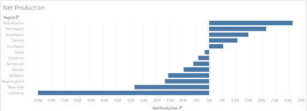
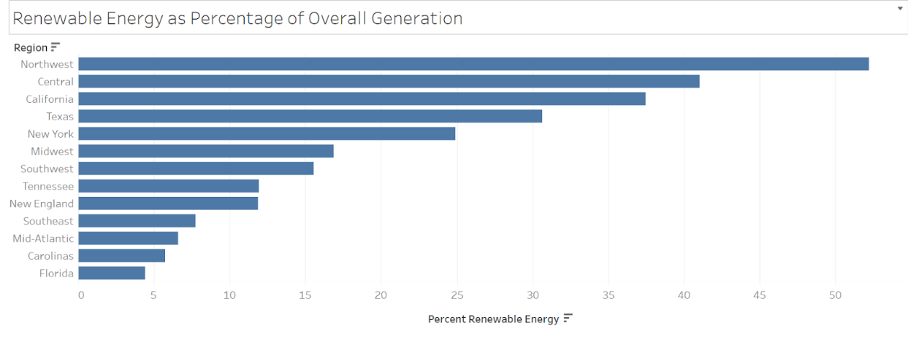

<p align="center">
  
</p>

# Intel Energy Data Center Analysis

## Overview

This project focuses on analyzing energy production and consumption across various U.S. regions to assist Intel in selecting an optimal location for a new data center. The analysis considers factors such as energy availability, usage, and the reliance on renewable energy sources, with the goal of identifying regions that produce a surplus of energy and have strong renewable energy infrastructure.

## Problem Statement

Intel, a leading semiconductor manufacturing company, is planning to build a new data center. Energy availability and usage are critical factors in determining the best location for this data center. Important questions to answer include:
- Which regions produce a surplus of energy, making them likely to offer energy at lower prices?
- Which regions rely more on renewable energy sources?

## Datasets

The analysis used three primary datasets:

- **`intel.energy_data`**: Contains daily energy production and consumption data across various U.S. regions, including fields such as balancing authority, date, region, time of energy generation, demand, net generation, and the contribution of various energy sources (e.g., petroleum, coal, hydropower, natural gas, nuclear, solar, wind).

- **`intel.power_plants`**: Provides general information about power plants in the U.S., detailing plant name, code, region, state, and primary technology used.

- **`intel.energy_by_plant`**: Contains total energy production data at the plant level for the year 2022, including energy type (renewable or fossil fuel) and total energy generated in megawatts (MW).

## SQL Analysis

### Energy Generation by Region

#### Total Energy Production by Region
To identify regions that are net energy producers, we calculated the total energy produced per region by subtracting the energy demand from the net generation.

```sql
SELECT region, SUM(net_generation - demand) AS total_energy
FROM intel.energy_data
GROUP BY region
ORDER BY total_energy DESC;
```

<p align="center">
  
</p>

Result: The Mid-Atlantic region was identified as the region with the highest positive total energy, indicating it produces significantly more energy than it consumes.

#### Renewable Energy Production by Region
To focus on regions generating energy primarily from renewable sources, we calculated the total renewable energy production by summing up the energy produced from hydropower, wind, and solar sources.

```sql
SELECT region, SUM(hydropower + wind + solar) AS renewable_energy
FROM intel.energy_data
GROUP BY region
ORDER BY renewable_energy DESC;
```

<p align="center">
  
</p>

Result: The Northwest and Texas regions emerged as the top producers of renewable energy.

#### Percentage of Renewable Energy by Region
To understand the reliance on renewable energy, we calculated the percentage of energy generated from renewable sources relative to the total energy generation.

```sql
SELECT region, 
       (SUM(hydropower + wind + solar) / SUM(net_generation)) * 100 AS renewable_percentage
FROM intel.energy_data
GROUP BY region
ORDER BY renewable_percentage DESC;
```

Result: California, while not leading in total renewable energy, has a higher percentage of its total energy coming from renewable sources compared to Texas.
When considering the percentage of renewable energy, California replaced Texas in the top three regions, indicating that while Texas produces a large volume of renewable energy, California's energy production is more heavily reliant on renewables.

Comparison of Regions Based on Total vs. Percentage of Renewable Energy
A comparison between total renewable energy and the percentage of renewable energy by region shows that different regions lead depending on the metric used. This highlights the importance of considering both total production and sustainability when making decisions about data center locations.


#### Aggregating Power Plant Data
Counting Renewable Power Plants by Region
We joined the intel.power_plants and intel.energy_by_plant tables to assess the distribution and output of renewable power plants across regions.

Result: The Midwest region was found to have the highest number of renewable power plants.

#### Solar Photovoltaic Power Plants
We focused on solar photovoltaic technology by assessing the total number of such plants and the total energy generated.

```sql
SELECT region, COUNT(*) AS solar_plant_count, SUM(total_energy) AS total_solar_energy
FROM intel.power_plants pp
JOIN intel.energy_by_plant ep ON pp.plant_code = ep.plant_code
WHERE pp.primary_technology = 'Solar Photovoltaic'
GROUP BY region
HAVING solar_plant_count >= 50
ORDER BY total_solar_energy DESC;
```

Result: The Midwest region, despite having a large number of Solar Photovoltaic plants, generates less power compared to other regions, indicating potential inefficiencies or smaller plant sizes.


#### Recommendation
Based on the analysis, the Northwest region, particularly Washington State, is recommended for Intel's new data center. This region not only produces a substantial amount of renewable energy but also has a higher percentage of its total energy coming from renewable sources. The Northwest's balance of energy availability, sustainability, and infrastructure makes it the most suitable location for Intel's data center.

